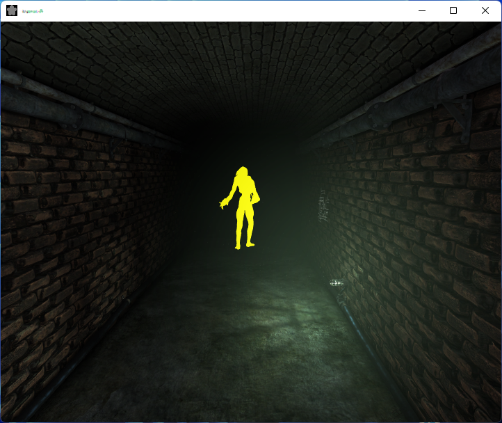

# Exemplar DriectX 9 Chams
Simple DirectX 9 chameleon skins cheat for pc games

Currently only 32-bit x86 is supported.

## Usage Example

# Compile Instructions

To compile you will need [Visual Studio 2022 with C++](https://visualstudio.microsoft.com/vs/features/cplusplus/) installed, as well as [Microsoft DirectX SDK (June 2010)](https://www.microsoft.com/en-us/download/details.aspx?id=6812).

Open the solution and click the build button
